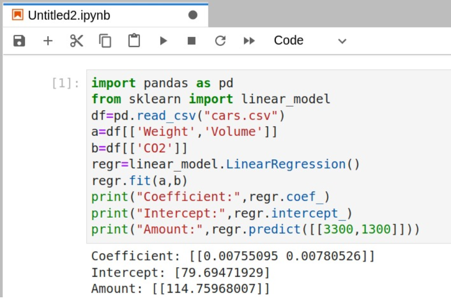

# Implementation of Multivariate Linear Regression
## Aim
To write a python program to implement multivariate linear regression and predict the output.
## Equipment’s required:
1.	Hardware – PCs
2.	Anaconda – Python 3.7 Installation / Moodle-Code Runner
## Algorithm:
### Step1
Import Pandas library.

### Step2
Import Linear_model from sklearn.

### Step3
Read the csv file using pandas library.

### Step4
Enter the parameters of the linear function.

### Step5
Print the parameters of the linear function. End the program.

## Program:
```
Developed by: T Roshini
Reference number: 23011660
import pandas as pd
from sklearn import linear_model
df=pd.read_csv("/content/cars (1).csv")
x=df[['Weight','Volume']]
y=df['CO2']
regr=linear_model.LinearRegression()
regr.fit(x,y)
print("Coefficient:",regr.coef_)
print("Intercept:",regr.intercept_)
predictedCO2=regr.predict([[3300,1300]])
print("Predicted CO@ for the corresponding weight and volume",predictedCO2)
```
## Output:

### Insert your output



## Result
Thus the multivariate linear regression is implemented and predicted the output using python program.